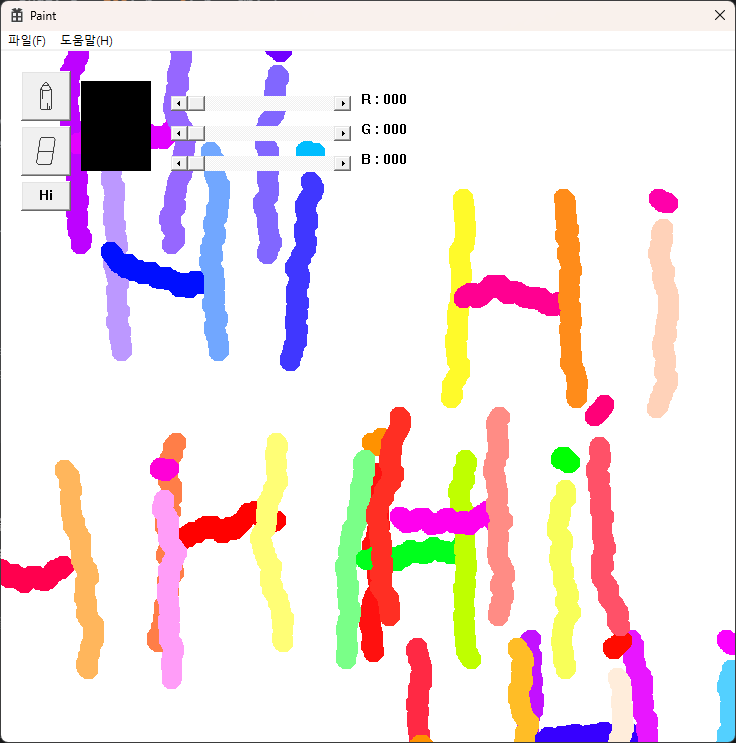

# WinAPI-Paint

Windows API를 활용하여 제작한 간단한 그림판 프로그램입니다. 

`색상 변경`, `그리기`, `지우기`, `Hi 버튼` 기능을 지원합니다.

## 참고 및 학습 자료

이 프로젝트는 아래 자료들을 참고하며 코드를 작성하고 학습했습니다.

- 블로그: [Gon91 | WinAPI를 사용한 그림판 프로그램 제작](https://blog-of-gon.tistory.com/286)
- GitHub: [Gon-91 | Win32API-Lean](https://github.com/Gon-91/Win32API-Lean)